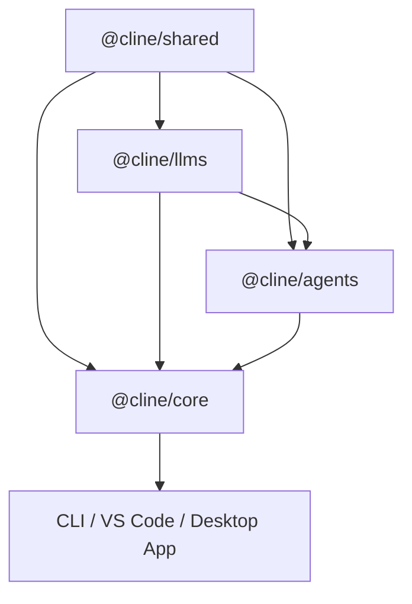

# Cline SDK — 开发参考

面向活跃开发的快速参考。关于入门、工作区设置、发布与详细工作流，见 [CONTRIBUTING.md](./CONTRIBUTING.md)。关于架构与运行时流程，见 [ARCHITECTURE.md](./ARCHITECTURE.md)。关于 API 细节，见 [DOC.md](./DOC.md)。

## 仓库范围

本文件适用于以此目录（`sdk/`）为根目录的 SDK 工作区。在本仓库中，除非另有明确说明，"root"（根）指 SDK 工作区根目录。SDK 开发时忽略旧的仓库根目录，仅在明确需要 Git 操作或全仓库搜索时除外。

从 `sdk/` 运行 SDK 命令，而不是从旧的仓库根目录。不要运行诸如 `bun test sdk/...` 之类的根级直连命令；它们会绕过 SDK 工作区设置，可能无法正确解析 `workspace:*` 包。

## 包边界

### 已发布的 SDK 包

- `@cline/shared`：共享契约、schema、路径辅助函数、hook 引擎、扩展注册表、底层工具
- `@cline/llms`：提供商设置/配置、模型目录、提供商清单、网关契约、handler 创建
- `@cline/agents`：无状态 agent 循环、工具编排、hook/扩展运行时、事件流式输出
- `@cline/core`：有状态编排、会话生命周期、存储、配置监听、插件加载、默认工具、遥测。暴露 `@cline/core/hub`（用于发现、分离守护进程入口、WebSocket 客户端与会话/UI 客户端适配器），以及 `@cline/core/hub/daemon-entry`（用于启动共享守护进程）

### 依赖方向



规则：
- `shared` 保持底层与可复用
- `agents` 保持无状态 —— 不涉及会话/存储/配置
- `core` 拥有有状态编排，包括 `src/hub/` 下的共享 hub 守护进程、服务端与客户端适配器
- `@cline/core/cloud` 拥有远程云会话传输与状态；宿主负责认证、功能门控、持久化与 UI 投影。

## 变更归属

将变更提交到拥有该关注点的包：

- 模型/提供商 schema 或 handler 行为：`@cline/llms`
- 无状态循环、工具编排、流式输出、hook/扩展运行时：`@cline/agents`
- 会话生命周期、存储、配置监听、默认工具、插件加载、遥测、hub 运行时服务、hub 发现、hub 守护进程生成，以及面向会话的客户端辅助函数（`HubSessionClient`、`HubUIClient`、`connectToHub`）：`@cline/core`（hub 相关代码位于 `src/hub/` 下）
- remote-config schema、托管指令物化、blob 上传元数据与 OpenTelemetry 配置规范化：`@cline/shared/src/remote-config`
- 宿主特定的 UX 或 shell 行为：应用包

## 验证变更

在新的 worktree 中测试之前，先安装 SDK 依赖（在 SDK 工作区根目录）：

```sh
cd sdk
bun install --frozen-lockfile
```

SDK 包的导出通过编译后的 `dist/` 文件解析同级包。如果 `dist/` 缺失，请在运行包测试之前构建 SDK 包：

```sh
bun run build:sdk
```

跨包信心的 SDK 根命令：

```sh
bun run types       # 类型检查所有包
bun run test        # 运行所有测试
bun run check       # lint + 构建 + 类型检查 + check-publish
```

定向验证时，优先从 SDK 根目录使用工作区包脚本：

```sh
bun -F @cline/shared test
bun -F @cline/llms test
bun -F @cline/agents test
bun -F @cline/core test:unit
bun -F @cline/cli test:unit
```

如果某个定向测试命令失败并提示缺少 `@cline/*` 导出或缺少 `dist/` 文件，请构建相关依赖包或运行 `bun run build:sdk`，然后重新运行同一测试命令。应将其视为工作区设置问题，而不是源码 bug 的证据。

如果你改动了 hub/bootstrap/session 流程，请更新 `ARCHITECTURE.md`。

## 实践指南

### 保持边界整洁

- 不要把有状态逻辑下沉到 `agents`
- 对于 `@cline/llms` 的提供商/模型路由规则，请遵循 [packages/llms/AGENTS.md](./packages/llms/AGENTS.md)。
- 不要把应用特定行为放进 `core`，除非它确实是宿主共享行为
- 让 `shared` 中的 remote-config 原语保持通用；面向宿主的会话集成属于 `core`

### 重构标准

- 优先直接进行架构清理，而不是兼容垫片
- 把代码移动到拥有该关注点的层，并更新所有调用点
- 如果某个辅助函数只是投影 watcher 状态，请将其保留在配置层，而不是创建薄薄的运行时包装

## 文档职责

- `README.md`：面向访客的概述。当仓库故事或包清单变化时更新。
- `CONTRIBUTING.md`：入门、工作流、发布。当贡献者设置或发布流程变化时更新。
- `AGENTS.md`（本文件）：开发参考。当包边界、依赖规则或变更归属变化时更新。
- `ARCHITECTURE.md`：设计、边界、运行时流程。当系统设计或架构约束变化时更新。
- `DOC.md`：API 与行为参考。当导出接口、生命周期语义或运行时行为变化时更新。