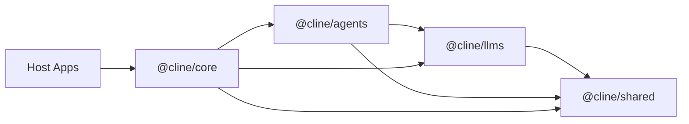

# Cline SDK 架构

本文档是 Cline SDK 仓库的架构权威依据（source of truth）。它描述了系统如何组织、组件如何交互，以及指导开发决策的设计原则。

**谁应该阅读本文？**
- 跨多个包协作的 SDK 贡献者
- 使用 `@cline/core` 构建集成或宿主应用的开发者
- 需要理解运行时与扩展系统的插件作者

**本文涵盖：**
- 包边界与职责划分
- 依赖方向与分层规则
- 运行时流程（本地、Hub 托管、远程配置托管）
- 设计接缝（用可复用的统一模式替代一次性集成）
- 架构约束及其存在的原因

**本文不包含：**
- 面向新贡献者的入门指南（见 README.md 与 CONTRIBUTING.md）
- 详细 API 参考（见各包 README 与内联 JSDoc）
- 用户指南（见官方文档）

## 分层模型

工作区按「分层运行时栈」组织。

## 各包职责

### `@cline/shared`

负责可复用的底层契约与基础设施：

- 共享类型与 schema
- 路径解析
- Hook 契约/引擎
- 扩展注册表契约
- prompt 与解析辅助工具
- 存储路径辅助工具
- 远程配置 schema、受管指令物化（materialization）、遥测规范化与 blob 上传原语

设计规则：

- `shared` 不应依赖更高层的运行时包。

### `@cline/llms`

负责模型/提供商（provider）运行时相关事项：

- 提供商设置/配置解析
- 模型目录与清单（manifests）
- 共享的网关式提供商契约
- 通过内部网关注册表创建 handler
- 基于 AI SDK 的提供商执行代码

设计规则：

- 特定于提供商的行为应隔离在此包内，而不是散布到 `core` 或应用层。
- AI SDK 响应的 `X-Request-ID` 元数据会沿着既有的模型 `finish` 事件传递到 `afterModel.requestId`。它标识的是最终对外呈现的那一步，而不是每一次隐藏的 HTTP 重试。宿主无需包装传输层、也无需新增请求回调 API，即可通过既有的模型 hook 进行观测。VS Code 的 Git 观测属于「打开的会话」，而非 SDK 运行时：`ended` 事件在失败后可能让会话保持打开。启动清理会处理未真正打开的观察者；宿主显式的 stop/dispose 会同时关闭普通与恢复的观测窗口。观察者绑定的是 Core 的 start/restore 结果实际返回的 ID。VS Code 以交互方式启动时不带 prompt，只在该结果返回后才发送 prompt。start 与 restore 各自显式准备自己的输入与观察者，因此重叠启动无需异步上下文桥接。遥测永远不会提供或修改 `config.sessionId`——那样会把新会话变成重启。`afterModel` 会启动一次有界的后台 Git 读取，并在可用时以触发响应的 request ID 发出事件，且不会在工具执行前等待。每个观察者在已有读取进行中时会跳过采集，从而避免排队与乱序事件。工具可能在读取期间修改文件：这表示「响应 R 之后观测到的状态」，而不是原子性的工具执行前快照，也不代表这些改动是由 R 引起的。每个窗口先发出首个快照，此后仅在 Git 字段或 workspace-root 数量发生变化时才发出。没有「打开、让出（yield）、空闲」类的发出事件，也没有 Git 扩展的 watcher。最后一次模型调用之后的变更需要更晚的调用才能被观测到。消费方必须在该窗口内自行向前传递观测结果，而不是期望每个请求都有事件。已在 dirty 状态下重复编辑不一定会改变记录的标志位。状态限制会把廉价的 identity 读取保留为 `partial`，且不带 dirty 标志。字段级契约见 `packages/core/src/services/telemetry/core-events.ts` 中的 `GitSnapshotProperties`。

### `@cline/agents`

负责无状态的运行时循环：

- Agent 迭代循环
- 工具编排（tool orchestration）
- 运行时事件发射
- Hook/扩展执行
- 调用提供商之前的轮次准备（turn preparation）
- 内存内的团队/运行时原语

设计规则：

- `agents` 不应负责持久化存储或宿主生命周期相关事务。

### `@cline/core`

负责有状态的编排：

- 运行时组装（runtime composition）
- 会话生命周期
- 存储与持久化
- 配置监听/加载与 watcher 投影
- 设置列出与变更编排
- 默认宿主工具装配
- 插件发现/加载
- 默认上下文压缩（compaction）策略
- 遥测集成
- `src/hub/` 下的 Hub 服务器与定时运行时服务
- Hub 发现、分离式 Hub 守护进程，以及 `@cline/core/hub/daemon-entry` 子路径
- 从 `@cline/core/hub` 导出的宿主侧 Hub 客户端适配器（`NodeHubClient`、`HubSessionClient`、`HubUIClient`、`connectToHub`）
- 从 `@cline/core/cloud` 导出的实验性云会话客户端：云 API 访问、远程会话生命周期与 transcript（对话记录）对账

设计规则：

- `core` 是面向应用、构建在 `agents` 之上的编排层。
- `session/fork-metadata` 负责 fork 溯源（ancestry）以及清理继承的 handoff 标记；标题、transcript 与工作区恢复策略仍由宿主保留。
- `@cline/core/cloud` 负责远程云会话状态，并发出不可变的快照与事件。使用 `readMessages` 加载进行中运行的查看方，即使错过了运行开始，也会在完成时对账权威历史。宿主提供认证并将快照投射到自己的 UI 中；特性开关、账号选择与宿主持久化仍在该控制器之外。导入该子路径不会初始化本地 Agent。
- `cloud/models` 负责云模型资格判定；`services/cloud-handoff` 负责 Git 预检、指纹（fingerprints）与 transcript 校验。传输编排、源端锁、持久化、特性门控与草稿恢复由宿主负责。
- 桌面包在凭据驱动的控制器替换过程中，会把「首个任务创建待定选项」保留在 context 持有的 map 中。共享控制器在内部任务已存在或被创建时消费该意图；只保留 ID 而不保留其审批策略是不够的。
- Hub 相关模块位于 `packages/core/src/hub/`，按服务分组：
  - `client/` 包含面向宿主侧的 Hub 客户端与浏览器连接辅助工具
  - `daemon/` 包含分离式守护进程的启动、入口与本地运行时 handler 装配
  - `discovery/` 包含端点默认值、发现记录与工作区所有者解析
  - `server/` 包含 WebSocket 服务器启动、原生/浏览器 socket 适配器、服务器传输、服务器辅助工具，以及用于 Hub 命令分发的 `handlers/`
- 设置变更应放在 core 服务与 Hub 命令中，而不是宿主特定的文件写入中。宿主应调用 core 设置门面（facade）或 `settings.*` Hub 命令族，并响应 `settings.changed` 事件。

## 运行时流程

### 本地进程内运行时（Local In-Process Runtime）

1. 宿主通过 `@cline/core` 构造 `RuntimeHost`。
2. `@cline/core` 通过 `packages/core/src/runtime/host.ts` 选择 `LocalRuntimeHost`。
3. 宿主在调用 `RuntimeHost.start(...)` 之前，把宽泛的本地配置规范化为 `RuntimeSessionConfig` 加上 `localRuntime` 覆盖项。
4. `@cline/core` 基于 `localRuntime` 准备本地引导（bootstrap）产物，然后据此构建运行时。
5. `@cline/core` 从 `@cline/agents` 创建 `Agent`。
6. `@cline/agents` 使用 `@cline/llms` 的 handler 运行循环。
7. `@cline/core` 持久化状态、产物与元数据。

完成（completion）遥测锚定在助手显式声明完成的那一刻，而不是会话关闭时。每个 Agent 轮次结束后，本地运行时会检查 `AgentResult.toolCalls`，一旦观测到成功的 `submit_and_exit`（对应原始 Cline 中 `attempt_completion` 的 SDK 等价物），立即发出 `task.completed`。单一拆除（teardown）咽喉点 `emitTaskCompletedOnTeardown(...)` 为「最后一轮干净结束但未显式观测到完成工具调用」的会话保留了兜底发射（非交互式运行且未使用 yolo 预设，或宿主禁用了 `submit_and_exit`）。它会在所有会话退出路径上被调用——包括 `shutdownSession(...)` 与 `releaseSessionRuntime(...)`——因此发射不依赖于停止走哪条拆除分支。每个会话最多发出一次 `task.completed`。事件载荷与 `source` 字段见 `DOC.md`。

### Hub 托管运行时（Hub-Backed Runtime）

1. 宿主通过 `@cline/core` 构造 `RuntimeHost`。
2. `@cline/core` 通过 `packages/core/src/runtime/host.ts` 选择 `HubRuntimeHost` 或 `RemoteRuntimeHost`。
3. 当尚未发现兼容的本地 Hub 时，`@cline/core` 可以生成一个分离式的 Hub 守护进程，并通过发现机制重新连接。spawner 最多等待 15 秒，直到守护进程发布可用的发现记录（Windows 上编译二进制的冷启动经常需要超过此前的 8 秒）。若守护进程仍未启动成功，运行时宿主会以 `No compatible hub runtime is available` 错误携带底层原因，同时守护进程在退出前会向遥测上报自身的启动失败（`hub.daemon.startup`）。
4. 宿主可以附着（attach）/脱离（detach）共享会话，而无需停止权威运行时，因此另一个客户端可以继续流式接收或稍后恢复同一会话。
5. Hub 托管的运行时使用 `@cline/agents` 与 `@cline/llms` 执行 Agent 循环。
6. `@cline/core` 的 Hub 服务负责会话、事件、审批、调度，以及客户端自有的运行时能力（如会话级工具执行器）的中转。
7. Hub 事件转发保留结构化的流式生命周期边界：文本/推理增量、文本/推理的最终完成、工具 start/update/finish、Agent done 事件，都会跨 Hub 传输层被转换，使宿主 UI 能可靠地关闭加载/流式状态。`run.started` 仅在目标会话解析完成后才发出，并携带发起命令的 `requestId` 与 `clientId`，使多客户端宿主能够关联投递确认。
8. 从 `@cline/core/hub` 导出的 Hub 客户端适配器（`NodeHubClient`、`HubSessionClient`、`HubUIClient`、`connectToHub`）会把命令/应答与事件流转译为面向宿主的 API。
9. Hub `session.get` 记录同时包含规范化的根会话用量和来自 Hub 自有 `RuntimeHost` 的显式聚合用量，因此附着的客户端无需重放事件流，也能有意选择渲染「仅根会话」或「根会话加队友」的成本。

Hub `session.send_input` 接受非空 prompt，或至少一个非空的图片/文件附件；两者皆无的请求会在启动轮次之前被拒绝。
NodeHubClient 的命令可以提供同步的本地 `beforeDispatch` 守卫。
它在连接建立之后、分配或发送命令之前、每次尝试时运行。
抛出异常会阻止该次尝试的派发；但已经派发出去的运行仍需要 `run.abort` 来终止。

会话状态是「如实报告」的，绝不虚构。会话的初始状态反映 `start(...)` 内是否真的有轮次在运行：带 prompt 的启动（一次性或交互式）以 `running` 开始；不带 prompt 的交互式启动在首个轮次前为 `idle`；恢复的会话报告其持久化状态。每个轮次拥有自己的 `running` → `idle` 转换。在客户端侧，`HubRuntimeHost` 只有当 Hub 会话记录或会话快照确实携带状态时才投射状态事件；仅有快照的 `session.updated` 事件（异步持久化更新，可能滞后于轮次最终的 idle 更新）报告快照的真实状态。把「工作区级操作」基于「会话忙」来门控的宿主（例如桌面端的 checkpoint 恢复门控）依赖这一点：一个没有归属轮次的、默认的 `running` 状态会让这类门控永远阻塞、无人清除。

命令进度遵循与其他 Agent 输出相同的运行时事件边界。Shell 执行器通过 `AgentToolContext.emitUpdate` 发出结构化的 stdout/stderr 块；Agent 运行时把它们投射为工具的 `content_update` 事件，Hub 再以 `tool.updated` 发布，并完整保留 session、tool-call 与 tool 标识符。Hub 客户端为宿主侧事件流重建该工具更新。客户端贡献的执行器也必须通过这条路径转发能力进度，而不是另建宿主特定的旁路通道。内置 Shell 执行器以很短的间隔合并输出，并在进入事件管道前限制每条流的待处理尾部；消费方则各自独立地合并与限制其渲染的回滚缓冲区（scrollback）。

「运行中继续（Proceed-while-running）」是显式的命令生命周期，与客户端或会话的脱离（detachment）无关。Shell 进程只有在已生成并注册到宿主级命令执行控制器之后，才会声明自己可脱离。客户端携带归属的 `sessionId` 以及（可用时的）`toolCallId` 发送 `run.proceed_while_running`；Hub 将其委托给权威 `RuntimeHost`，后者释放该工具调用下所有匹配的已注册进程。执行器会移除自己的中止与超时所有权，以当前有界输出与一个临时日志路径终结该工具调用，并继续把进程输出排入该日志。分离日志有大小上限，会在命令退出后保留一个有界的检查窗口，随后删除其临时目录。每个构造 `LocalRuntimeHost` 的进程都会启动一次「分离日志对账」：回收超出保留窗口的已完成日志、重新调度保留中的日志，并跟随「活跃分离命令」的身份直到其退出——因此清理不依赖「启动该命令的进程」的定时器。Hub 守护进程与直接嵌入方因此共享同一套脱离与重启生命周期，而无需依赖守护进程专用的入口。活跃命令标记会把 PID 与「进程代际启动令牌」配对，防止之后复用同一 PID 的无关进程延长日志寿命。完成标记区分「活着但可能静默的命令」与「已完成的日志」。进程探测区分「进程不存在」与「身份提供方不可用」。瞬时探测失败会保留活跃标记，绝不被当成命令完成的证据。对账会保留所通告的日志并重试，直到提供方能证明原进程仍存在、其 PID 属于替换进程、或进程已不存在。仅宿主退出永远不会为「仍存活命令」启动保留窗口；替换宿主会继续轮询进程身份，并且仅在命令结束后才开始保留计时。在提供方持续不可用期间，受上限保护的日志可能活得比正常保留窗口更久，因为「保留可能仍存活命令所通告的路径」优先于「猜测它已退出」。仅客户端连接脱离永远不会改变进程所有权或命令执行。

### 生成媒体的操作与事件流

模型模态（modality）与提供商操作（operation）是两个独立的概念。模态描述模型接受或产出的值类型；显式操作则选择提供商的传输通道。语言模型即使能产出媒体，也仍然走正常的 Agent 循环；而 `operation: "image-generation"` 会选择 `generateImage`，`operation: "transcription"` 会选择声明的语音转文字传输。操作特有的执行变体（如录播与实时转写）位于 `operationModes` 中，而不是通用能力列表里。专用操作采用「默认失败（fail closed）」策略，除非提供商清单与适配器都实现了它们——因此一个 OpenAI 兼容的聊天端点绝不隐含图像、音频、转写或视频端点。

生成媒体跨包边界的方式如下：

1. `@cline/llms` 对提供商输出做一次校验并创建规范化的 `GeneratedMedia` 值。该契约携带稳定 ID、模态、MIME 类型，以及可判别的 base64、HTTP(S) 或产物源（artifact source）。当前的生产者产出图像；音频、视频与大型产物文件使用同一契约。
2. 提供商模型工具是适配器，而不是原始的 AI SDK 工具。适配器负责把原生结果投射为规范媒体。通用流层会合并初步或重复的结果、执行每轮次的媒体预算，并且只持久化紧凑的活动摘要，而不是在模型工具元数据里重复存放 base64。
3. `@cline/agents` 会把媒体事件追加到助手消息中精确的流位置。该消息是回放与持久化的规范来源；观测性的提供商工具活动仅作为展示用的元数据。
4. `@cline/core` 将实时媒体投射为 `content_end(media)`。Hub 发布 `assistant.media` 并保留相同的媒体 ID，客户端据此对实时内容与加载内容去重。
5. Web 客户端共享来自 `@cline/ui` 的 `GeneratedMediaContent`，用于图像、音频、视频、文件与不可用源的渲染。内联字节只通过浏览器持有的短时 object URL 暴露；远程与产物源需要客户端自有的可信解析器。CLI 与 ACP 客户端提供与其传输相称的物化或降级输出，而不改变规范消息。

图像编辑推断刻意保持本地化：当专用图像模型接受图像输入、且当前用户消息中没有显式图像时，只会复用紧邻的上一条助手消息中的图像。更早的图像不会跨中间轮次被隐式附加。

会话历史来源（provenance）把「客户端界面」与「发起方式」分开记录。`StartSessionInput.source` 标识客户端（`vscode`、`desktop`、`cli`、`core` 等），而顶层 `StartSessionInput.mode` 标识会话是如何开始的（`user`、`automation`、`subagent` 或 `team`）。持久化的消息信封会同时记录这两个值，以及客户端版本与子会话谱系。缺失的发起方式默认为 `user`；自动化运行时适配器必须显式传入 `mode: "automation"`。

根会话的持久化是惰性的。启动运行时只分配会话 ID，并把配置或种子历史保留在内存中，而不会创建数据库行、manifest 或消息产物。第一个被接受的用户轮次才会持久化同一个 ID 及其产物。因此，在用户轮次之前关闭运行时不留下任何空历史条目，持久化代码也永远不会为未知会话分配替换 ID。

会话历史列表在持久化层过滤子行。子代理与团队任务会话与「派生它们的根会话」存储在
同一张表中，且总是排序更靠前，因此 `listSessionHistory` 会向运行时宿主请求
`rootOnly` 行。`LocalRuntimeHost` 把该选项传给会话后端，后者在查询中于 limit 之前
应用它；`HubRuntimeHost` 以 `session.list { limit, rootOnly }` 发送，hub handler
再转发给它的会话宿主。省略该标志会返回所有行，这正是渲染子代理树的调用方所依赖的。
历史层保留一个带「扩大扫描」的客户端根过滤，仅作为旧 hub 忽略该标志时的兜底。

工作区引导由执行该会话的运行时拥有。Hub 客户端会跨传输保留被省略的 `cwd` 与
`workspaceRoot`，使 hub 侧的执行宿主能在自己的文件系统上把会话放入共享聊天工作区
`<cline-data-dir>/workspaces/chat`（默认 `~/.cline/data/workspaces/chat`）。
聊天工作区会预置一个 `AGENTS.md` 规则文件，告诉 Agent 把该会话当作聊天，
只在用户明确要求时才创建命名项目文件夹。解析后的路径返回在会话快照中，
是客户端 manifest 的权威来源；传输客户端绝不能为远程运行时虚构本地路径。

分离式守护进程启动会在轮询发现之前重试瞬时的 `ETXTBSY` spawn 失败。这覆盖了
「包管理器更新恰好在某条命令重启共享 hub 之前替换了 CLI 二进制」的情形。

本地 hub 发现还携带共享守护进程的认证契约。启动时，hub 服务器生成一个密码学随机的
每进程认证 token，存入属主发现记录，并以「仅属主可读写」的文件权限写入该记录。
本地客户端在连接时从发现文件解析 token，而不是把它嵌入端点 URL。服务器在接受
`/hub` WebSocket 升级或 `/shutdown` 请求之前，用常量时间比较验证 token；
WebSocket 客户端通过 `Sec-WebSocket-Protocol` 头发送它，关闭请求使用
`Authorization: Bearer` 头。未认证的本地进程仍然可以探测公开的健康/构建元数据，
但无法附着会话、下发命令或停止守护进程。

用 HTTP 头认证「面向客户端的 WebSocket 升级」的远程代理使用
`NodeHubClient.resolveConnectionHeaders`。该 resolver 会为每个新 socket 运行
（包括重连），因此宿主可以刷新短时凭据。头认证与本地 hub-token 子协议互斥；
代理负责认证客户端并附加任何私有的上游 hub 凭据。Resolver 失败与被拒绝的协议头
会令连接失败，并保留在客户端的 connection-error 状态中。拥有活跃订阅的客户端
在头解析失败后会持续重试，即使当时并未创建 socket。

本地 hub 的重新发现仅限于「通过发现机制或 `ensure*HubServer(...)` 启动路径获得的
托管共享守护进程端点」。托管的本地 hub 必须同时匹配支持的线协议（wire protocol）
与当前 Hub 构建身份；来自其他构建的协议兼容守护进程会在其替代者启动之前退役，
使升级不会继续执行陈旧的运行时代码。SDK 构建会嵌入「运行时源码、包 manifest、
构建配置与依赖锁」的确定性指纹，因此即便包版本尚未递增，身份也会随可执行 Hub
代码的变化而变化。构建还嵌入可按时间排序的 build epoch：当指纹不同时，若某个托管
Hub 是在客户端自身构建 *之后* 产出的，则通过兼容线协议复用它而不是让其退役
（替换它会降级守护进程），同时客户端的构建不匹配 watcher 会提示用户更新并重启。
更旧、无时序或缺失构建元数据的 hub 会像以前一样退役并被替换，使两个并发运行的
安装收敛到最新构建，而不是反复互相替换守护进程。
显式端点（包括 `ws://127.0.0.1:<port>/hub` 这类环回 URL）是粘性的精确目标，
且保持「仅协议」语义：重连可以重试同一 socket URL，但命令恢复与启动死锁恢复
不得把它们替换为「工作区发现的 hub」。这可防止自定义本地 hub 与远程 hub
悄悄漂移到另一个进程。

### 交互式 CLI 启动

1. `apps/cli` 负责 OpenTUI 的启动，必须在不等待分离式 Hub 启动的情况下渲染第一帧。
2. 交互式会话使用 `backendMode: "auto"`，因此已兼容的 Hub 可以立即复用；而缺失的 Hub 只会在后台预热，TUI 为保证响应性会回退到本地运行时。
3. `cline hub`、调度、连接器与 `--zen` 等「必须依赖 Hub」的流程仍可调用显式 ensure 路径，因为这些命令在继续之前需要活着的 Hub。
4. 恢复（resume）时的数据加载被推迟到 `renderOpenTui()` 之后，因此加载历史消息不会阻塞 TUI 的初始绘制。
5. 未来所有 CLI/TUI 启动工作都应遵循同一规则：守护进程启动、发现轮询、提供商目录刷新、文件索引与恢复读取，必须是后台进行或由用户操作触发——除非某条命令在输出前显式需要这些结果。

### 连接器的持久化与恢复

1. `@cline/shared/db` 负责底层 SQLite 连接器存储以及一次性的旧版 JSON 导入。
2. Dashboard 配置与 CLI 连接状态分开记录。配置编辑只会替换存储的重连参数中由 dashboard 拥有的连接器与安全标志，保留 CLI 专用的运行时选项，并且只为「曾成功启动过的连接器」刷新参数。
3. `@cline/core` 负责连接器自动启动的持久化与重连编排。分离式 Hub 守护进程是启动时重连的唯一所有者，防止 dashboard 启动与其竞争、拉起重复进程。
4. 分离式连接器的启动只有在子进程创建之后才会被持久化。内部的分离式子进程在退出时保留该状态，而用户以交互方式干净退出会禁用自动启动。
5. CLI 与 dashboard 宿主通过分离式进程环境传递其连接器 CLI 启动规格（launch specification）。由包自带的守护进程入口使用该规格启动连接器重连包装器，而无需导入应用代码。
6. 分离式 Hub 入口暴露 `hubDaemonReady`，它只有在 WebSocket 服务器开始监听后才会 resolve。它会在发出就绪信号后开始重连尝试，重连失败保持「尽力而为」，不会拖垮 Hub。

### 远程配置托管的运行时（Remote-Config Managed Runtime）

1. 宿主或 core 包装器获取规范化的 `RemoteConfigBundle`。
2. `@cline/shared/remote-config` 在配置后缓存该 bundle。
3. Shared remote-config 把受管的 rules/workflows/skills 物化到工作区本地的 `.cline/<plugin>/` 下。
4. Shared remote-config 从 bundle 中派生通用 OpenTelemetry 配置与会话 blob 上传元数据。
5. `@cline/core` 暴露面向应用的集成包装器，把扩展、遥测与会话元数据应用到 `StartSessionInput`。
6. `@cline/core` 在本地引导期间消费准备好的本地覆盖项。

这样可复用的 remote-config 行为保留在 `shared`，而会话特定的桥接保留在 `core`。

## 设计接缝（Design Seams）

代码库依赖少量「重复出现的接缝」，而不是一次性集成路径。

### 1. 配置 Watcher

Core 使用基于文件的发现与 watcher 处理：

- rules（规则）
- workflows（工作流）
- skills（技能）
- agents（智能体）
- hooks（钩子）
- plugins（插件）

设计含义：

- 新的指令来源通常应物化为文件，并复用基于 watcher 的加载，而不是发明并行的内存执行路径。
- 在 `packages/core` 中，面向配置的发现、解析、监听与斜杠命令投射位于 `src/extensions/config` 下。

### 2. 运行时构建器的输入

`DefaultRuntimeBuilder` 用通用输入组合运行时：

- tools（工具）
- hooks（钩子）
- extensions（扩展）
- 用户指令 watcher
- telemetry（遥测）

设计含义：

- 更高层的集成应优先向这些接缝「喂料」，而不是直接打补丁修改 Agent 内部。
- 本地运行时引导位于 `packages/core/src/services/local-runtime-bootstrap.ts`，它向构建器喂料，而不是绕过构建器。

### 3. 运行时宿主的边界（Runtime Host Boundary）

Core 暴露唯一的共享执行边界：`RuntimeHost`。

具体实现：

- `LocalRuntimeHost` 用于进程内执行
- `HubRuntimeHost` 用于共享本地 Hub 执行
- `RemoteRuntimeHost` 用于显式的远程 Hub 端点

设计含义：

- 宿主选择发生在 `packages/core/src/runtime/host.ts`
- `ClineCore` 统一委托给 `RuntimeHost`，不会按「本地 vs Hub」分支
- 传输特定的转换属于具体宿主内部，而不属于顶层编排
- `RuntimeHost` 的输入保持「传输安全」，而 `ClineCore.start(...)` 是面向应用的门面，在委托之前把宽泛的本地配置规范化
- `RuntimeSessionConfig` 在本地、共享 Hub 与远程 Hub 模式之间保持传输中立；宿主本地的引导事项留在 `localRuntime` 之下
- 必须在 Hub 模式下存活的「客户端本地运行时行为」（例如 `defaultToolExecutors`）在会话启动时附加，并通过 Hub 能力请求代理，而不是改变宿主选择
- 待发 prompt 的列出/更新/删除通过分组的 `ClineCore.pendingPrompts` 服务暴露。用量摘要查询与活动会话模型切换同样是服务型能力，会在具体传输实现它们时通过 `ClineCore` 暴露。这些服务 API 有意置于最小化的 `RuntimeHost` 原语词汇表之外。
- `session.abort` 在本地与 Hub 托管执行中都是根会话的取消边界。拥有该会话的 `LocalRuntimeHost` 会中止主（lead）Agent，并且只要求该会话的团队运行时取消活跃的同步队友工作以及正在运行或排队的异步运行。队友定义与会话状态仍保留给后续轮次使用；空闲和无关的团队运行时不会被停止。一次性 `spawn_agent` 委派通过其 `SessionRuntime` 观察父轮次的中止信号。团队运行时会把「有意中止」的任务结束事件标记为 cancelled，因此持久化不会把它们记录为失败。
- 用量服务的 `getAccumulatedUsage(sessionId)` 方法返回的摘要带有两个显式分桶：`usage` 表示根/主 Agent 的用量，`aggregateUsage` 表示根加上队友/子 Agent 的用量。本地执行把根用量与队友用量作为独立分桶跟踪，再从这两个分桶推导聚合总量；而遥测仍只覆盖主（lead/root）Agent。
- 用量事件报告「非推理」的 `outputTokens`，以及单独的可选 `reasoningTokenCount` 增量。`RuntimeEventAdapter` 从累计的运行时用量推导这两个增量；`HubRuntimeHost` 重建事件时，Hub 的 `usage.updated.delta` 载荷会保留它们。`task.tokens` 遥测同样把推理 token 与 `tokensOut` 分开报告。提供商计费仍按输出费率包含推理 token。

### 4. 设置变更边界

Core 通过 `packages/core/src/settings` 负责设置快照与变更。Hub 通过 `settings.list` 与 `settings.toggle` 暴露同一路径。

设计含义：

- 宿主不应直接修改 skill、tool、MCP、provider 或其他设置文件
- 领域特定的持久化辅助工具（例如 skill markdown frontmatter 的写入）保留在拥有它的设置 provider/service 内部
- 成功的 Hub 托管变更会返回更新后的设置快照，并以发生变化的设置类型发布 `settings.changed`
- CLI 设置界面可以为启动响应性保留本地快照渲染，但变更流程必须在重新加载 UI 数据前刷新相关的 watcher

### 5. 会话启动引导（Session Startup Bootstrap）

`ClineCore.create(...)` 暴露通用的 `prepare(input)` hook。

设计含义：

- 更高层的包可以在会话开始前准备工作区作用域的运行时状态
- core 保持对企业特定契约无感知
- 清理保留在宿主边界，而不是放进 Agent 循环内部

### 6. 日志（Logging）

跨包日志使用从 `@cline/shared` 导出的一个小型注入式接口：

- **`BasicLogger`** —— 必需的 `debug` 与 `log`；可选的 `error`。宿主把它们映射到各自的后端（Pino、VS Code `OutputChannel` 等）。许多运行时选项接受 `logger?: BasicLogger`；省略时，组件会跳过日志，或在需要完整对象处使用 `noopBasicLogger`。
- **`BasicLogMetadata`** —— 可选的结构化字段（`sessionId`、`runId`、`providerId`、`toolName`、`durationMs` 等），当单一方法必须同时表示信息类与警告类消息时，`log` 上还可带 `severity`（例如 CLI 的 Pino 桥会把 `severity: "warn"` 映射为 Pino 的 `warn`）。

命名澄清：

- **`CliLoggerAdapter`（CLI）** —— 一个**宿主包（host bundle）**：持有原始 `pino` logger（用于文件路径、轮转与 CLI 专有事项），并为任何消费 SDK 契约的代码暴露 `.core: BasicLogger`。它不是 `ITelemetryAdapter`。
- **`TelemetryLoggerSink`（`@cline/core`）** —— 一个 **`ITelemetryAdapter`**，把遥测事件与指标镜像到 `BasicLogger`。它是遥测接收端（sink），不是宿主日志实现。

Agent 与其他调用点把原先的 `info` / `warn` 语义统一走 `log`（警告会在元数据中带上 `severity: "warn"`）。错误在实现了 `error` 时优先使用 `error`；否则回退为带 `severity: "error"` 的 `log`。

设计含义：

- 日志是可注入且与传输无关的，允许宿主环境（CLI、VS Code、浏览器）接入自己的后端
- 不要硬编码日志调用；而是接受 `logger?: BasicLogger` 参数

### 6.1 Langfuse 遥测归属

`@cline/llms` 负责 Langfuse 插桩、trace 属性传播，以及 `LangfuseAttributesSpanProcessor`。`@cline/core` 负责宿主的 OpenTelemetry provider，并在构建 OTLP trace 管道时安装该 processor。该 processor 把上下文属性拷贝到 `cline-provider-langfuse` span 上；它不创建 exporter，也不要求 Langfuse 凭据。为了让 Langfuse 正确跟踪，用户 ID 与会话 ID 必须是 span 属性，而不能只作为观测元数据。

在使用 collector 中转路径时，span 走既有的宿主 OTLP exporter。collector 负责 Langfuse 凭据以及下游过滤与采样。`llms` 按请求检查提供商资格、客户端采样、退出选项（opt-out）与内容策略。宿主负责冲刷（flush）与关闭自己的 provider。

没有宿主中转可用时，显式配置的「直接 Langfuse 导出」使用一个由 `llms` 拥有并释放的隔离 provider。它不会替换或关闭环境中的宿主 provider。当两条路径都配置时，中转路径优先，确保请求不会通过两条路径重复导出。

### 7. 存储适配器（Storage Adapters）

有状态的持久化应隔离在适配器/服务层之后。

设计含义：

- 基于文件、基于 SQLite、基于 RPC 以及企业特定的持久化，应尽可能共享服务逻辑，并把后端差异隔离在适配器中。

### 8. 扩展与 Hook 系统

可扩展性被有意识地拆成两部分：

- 扩展（extensions）注册运行时贡献
- Hook 拦截生命周期阶段

设计含义：

- 增量式的运行时行为通常应通过这些扩展点进入，而不是宿主里「每事一议」的特判代码。

### 9. 上下文压缩（Context Compaction）

上下文压缩由 `core` 负责。

- `@cline/agents` 负责通用的「轮次准备」接缝：
  - 运行正常的生命周期 hooks
  - 允许宿主在调用提供商之前投射消息历史或系统提示词
  - 当返回了投射结果时，保持其规范运行时 transcript 只追加（append-only）
- `@cline/core` 负责压缩策略：
  - 为根会话注入 prepare-turn 管道
  - 通过注册表 map 在内置策略间选择
  - 把最新的压缩工作上下文持久化为「会话压缩产物」
  - 把压缩逻辑挡在底层 Agent 消息构建器之外

设计含义：

- 压缩是 `core` 拥有的上下文管道关注点
- 规范会话历史以完整保真度存放在会话消息产物中；压缩状态单独存放在 `${sessionId}.compaction.json`
- 恢复时会加载规范 transcript 用于历史/调试，并在存在压缩状态时，仅在校验「该状态覆盖的规范前缀」的哈希之后复用最新的压缩状态；有效状态通过追加压缩边界之后写入的规范消息来投射
- 在此模型之前就已用「压缩后的消息」持久化的会话只能尽力而为，因为被省略的原始 transcript 无法从压缩产物中恢复
- 从其他编码 Agent 导入的会话（`metadata.importedFrom`）若在无压缩状态下恢复，会在首个轮次总结其全部「外来 transcript」，与自动压缩设置无关；摘要会作为正常压缩状态持久化，因此模型永远不会重放源 Agent 的工具调用，同时规范 transcript 保持完整
- `agents` 继续专注于无状态循环与提供商/工具编排
- 委派/子 Agent 流程应通过 core 会话配置继承压缩行为，而不是经由独立的 Agent 级压缩 hook 表面

### 10. Core 内部的扩展分层

`packages/core/src/extensions` 按关注点拆分：

- `extensions/config`：配置加载器、解析器、watcher，以及诸如「运行时斜杠命令展开」之类的 watcher 投射
- `extensions/plugin`：运行时插件的发现、加载与沙箱化
- `extensions/context`：core 拥有的上下文/消息管道关注点，例如压缩

设计含义：

- 避免把配置发现代码混入运行时/插件代码
- 当某个 helper 本质上是在投射 watcher 状态时，避免再创建一层薄薄的运行时包装文件

被沙箱化的插件子进程是会话级（session-local）的，但可以惰性重建。Core 会在 30 分钟没有进行中 RPC 调用后回收沙箱（可通过 `PluginSandboxOptions.idleTimeoutMs` 或 `CLINE_PLUGIN_IDLE_TIMEOUT_MS` 配置），下一次插件调用会透明地启动并重新初始化它。待处理请求与「拥有它们的子进程代际」关联，因此旧进程退出不会拒绝发往其替代者的工作。当父进程的 IPC 通道断开时，bootstrap 也会退出。父进程是空闲关停的唯一权威，因此竞态的截止时间不会在父进程派发新工作时终止子进程。

设计含义：

- 沙箱进程数量随「最近活跃的会话」伸缩，而不是 hub 启动以来观察到的每个会话
- 驱逐（eviction）永远不会打断进行中的插件调用
- 进程内插件状态在空闲驱逐后即失效（ephemeral）；持久的插件状态应放在持久化存储中
- 沙箱绝不能比拥有它的 hub 进程活得更久

## 架构约束（Architectural Constraints）

### 保持 `agents` 无状态

不要把这些关注点移入 `@cline/agents`：

- 会话持久化
- 提供商设置存储
- RPC 生命周期
- 宿主特定的审批
- remote-config 策略缓存

### 保持 `core` 通用

不要让 `@cline/core` 变成组织或提供商特定的。

如果某个能力确实是通用且面向应用的，就添加一个通用的 core 接缝。可复用的 remote-config 解析、物化与上传原语属于 `@cline/shared/remote-config`。

### 使用单向的可选分层

可选的高层集成可以依赖低层。低层不应依赖可选的功能包。

对 remote config 而言：shared 拥有可复用的 bundle/物化/blob 原语，core 只拥有导出给应用的、面向会话的包装器。

## Hub 拥有的 Agenda 任务队列

Agenda 任务是「未来工作的持久化提议」。它们有意与 cron spec、既有会话内排队的 prompt，以及 Agent 团队任务板区分开。共享的、浏览器安全的契约使用 `AgendaTaskRecord` 与 `AgendaTaskRunRecord`；编排与持久化仍留在 `@cline/core`。

> **状态：** 在 Agenda UX 重构期间，`tasks` 工具中面向 Agent 的 `kind: "todo"` 一半，以及桌面端 Agenda UI 被暂时禁用（`hub-server-transport.ts` 中的 `AGENDA_TODO_TOOL_ENABLED` 与桌面 webview 中的 `AGENDA_UI_ENABLED`）。当该开关关闭时，Hub 也会跳过 agenda spec 文件 watcher——没有任何东西消费 watcher 驱动的任务事件，而 `task.*` 命令会按需对账 spec 文件。下文描述的后端——manager、存储、`task.*` Hub 命令与桌面端管线——保持完整接线，并且 schedule 类型仍然活跃。

### 权威与持久化

- 一个 Hub 进程拥有一个 Agenda 任务管理器。其 `AgendaTaskManagerApi` 边界是唯一允许修改任务生命周期、审批、运行或会话关联状态的地方。Hub 命令、文件导入与 Agent 工具的所有变更都必须经由该边界。
- 用户可编辑的意图以「带 YAML frontmatter 的 Markdown」表示：全局任务位于 `~/.cline/tasks/*.task.md`，工作区任务位于 `<workspace>/.cline/tasks/*.task.md`。status、revision、approval、session ID 等操作字段在 spec 中不可写。`AgendaTaskSpecFileStore` 会把路径限制在所选任务目录内，并以原子方式写入 spec。
- `SqliteAgendaTaskStore` 拥有 `tasks.db`（由 `resolveTasksDbPath()` 解析）。SQLite 是任务状态、版本修订、运行尝试、会话关联与自动化策略的操作权威来源；Markdown 文件是可编辑任务描述的规范来源，而不是只追加队列，也不能替代并发控制。
- 任务文件的解析与对账必须喂给 manager，而不是直接写 SQLite。这样无论变更来自编辑器、桌面客户端、SDK 客户端还是 Agent，都保留同一条校验与审计边界。
- Manager 启动时会扫描全局任务 spec、恢复持久化的任务/运行状态，并重新附着每个「目录仍然存在」的已知工作区。缺失的历史工作区会保留在 SQLite 中，但不会重建项目目录。选择/列出某工作区会将其注册，使哪怕是它第一个手写的任务文件也能被发现并监听。文件系统变更通过对账回到同一个 manager，而不是由 watcher 回调直接应用。
- 原始文件（raw-file）的创建与编辑会被归属到 `system:file_reconciler`，并且总是让变更后的意图等待人工任务审批。文件编辑永远不会重新打开已完成、已取消或已过期的任务；终态记录保持终态，并保留其「最后一次已知良好」的操作状态。

### 审批与会话执行

- 每个新任务从 `pending_approval` 开始。审批通过 `approvedRevision` 绑定到确切的任务 `revision`；与执行相关的编辑会递增版本修订并使过期审批失效。因此，一个已获批的版本在被认领执行的那一刻是不可变的。
- 审批与执行都会同步对账其背后的 Markdown 文件，以关闭 watcher 的防抖窗口。若规范 spec 缺失、格式错误，或与 SQLite 中的版本在语义上不匹配，两者都会「默认失败（fail closed）」；过期的「最后一次已知良好」意图永远不会被批准或执行。
- Hub `task.create` 与 `task.update` 的载荷省略 actor 字段；命令服务从调用的 Hub 客户端推导用户 actor。更新、审批、取消与运行请求会携带调用方当前显示的 `expectedRevision`；具体来说，`task.approve`、`task.cancel` 与 `task.run` 会拒绝缺失或过期的版本。
- P0 是最紧急优先级，P5 最不紧急。`expiresAt` 是必需的「最晚开始」边界：过期会阻止新的运行，但不会中止已经开始运行的会话。
- 启动任务会创建一条 `AgendaTaskRunRecord` 与一个普通的 Hub 会话。run 拥有任务/版本/会话的关联，而任务保留 `currentRunId`、`lastRunId` 与 `lastSessionId` 投射供 UI 查询。全局任务保持全局作用域，并只在其会话开始时解析 Hub 的共享聊天工作区。
- Manager 会把 Hub 会话的完成、失败与取消关联到对应的 run，并同时更新 run 与 task。启动恢复遵循同一边界，而不是凭空制造第二个 run。已完成的任务不拥有也不删除其会话；被关联的会话仍是普通会话历史，用户可随时重新打开。

### Hub、Agent 与桌面端界面（Hub, agent, and desktop surfaces）

- Hub 命令族为 `task.create`、`task.list`、`task.get`、
  `task.update`、`task.approve`、`task.cancel`、`task.run`、
  `task.automation.get` 与 `task.automation.set`。已注册的任务事件为
  `task.created`、`task.updated`、`task.deleted`、`task.run.started`、
  `task.run.completed`、`task.run.failed` 与 `task.automation.updated`。
  事件只是失效通知与生命周期信号；客户端应重新读取当前任务或策略投影，
  而不是从事件流中重建权威状态。
- Hub 托管的 Agent 会话会收到一个 snake_case 命名的 `tasks` 工具，其必填
  判别字段为 `kind`。`kind: "todo"` 在当前会话的工作区（聊天会话则为全局
  作用域）内创建、更新、列出与获取持久化的 Agenda 条目。它不能审批、取消
  或启动 Todo，因此 Agent 无法自行授权或终止队列工作。
- `kind: "scheduled"` 路由到 `HubScheduleService`，管理桌面端 Routine
  视图展示的同一批记录；统一工具并不会合并这两个持久化或生命周期领域。
  定时操作继承当前会话的工作区、cwd 与模型，读取与变更都限定在该工作区，
  且只允许从交互式会话发起变更。一次性定时接受确切的未来 ISO 时间戳；
  周期性定时接受五字段 cron 表达式与可选的 IANA 时区。
- Hub 为 `tasks` 贡献了一条「工具条件触发」的系统 prompt 规则。它区分
  「经人工评审的 Todo 工作」与「自主的定时执行」，说明 Todo 的 `available_at`
  不是定时器，对含糊的「提醒我」请求要求先澄清，并阻止在用户未明确要求时
  同时创建两种记录。
- `AgendaAutomationPolicy` 是用户自有的 Hub 状态。`manual` 保留逐任务评审
  门禁；`auto_start` 与 `unattended` 是显式选择加入。管理器的自动化泵会
  执行策略中的并发、链深度与每小时启动护栏。`auto_start` 等待具备工具审批
  能力的客户端连接，然后启动交互式任务会话，并对每个工具保守地要求审批。
  显式的 `unattended` 模式可以无头运行，并自动审批已启用的工具。
- 自动化绝不会从原始任务文件的变更中推断用户同意。对于 manager 背书
  的意图，`applyToAgentCreated` 管辖「最初由 Agent 创建的任务」以及「最近
  一次 manager 背书编辑来自 Agent 的任务」；禁用该项会让这些版本保持待人工
  审批。
- Cline Code 把同一份 Hub 状态投射到桌面端侧栏的 Agenda 区域，以及欢迎
  composer 下方按工作区过滤的 `suggestion`/`reminder` 快捷操作。侧栏支持
  评审、启动、取消、跳转关联会话与自动化开关；它不维护第二份任务存储。

## 基于文件与事件驱动的自动化（`ClineCore` / `CronService`）

`@cline/core` 在 `packages/core/src/cron/` 下附带了一套基于文件的自动化子系统。
它让运维人员可以把周期性与一次性任务写成 Markdown 文件（默认位于全局
`~/.cline/cron/` 下），并把事件驱动的任务写成 `events/*.event.md` 规格文件。
所有触发类型都通过同一个持久化队列与运行时 handler 执行。`ClineCore` 暴露
面向 SDK 的 `cline.automation.*` 入口；`CronService` 是 core 与 hub 层使用的
内部编排器。

### 分层（Layers）

1. **Spec 解析器**（`cron/specs/cron-spec-parser.ts`）：把 YAML frontmatter +
   正文解析为 `CronSpec` 可辨识联合（`one_off | schedule | event`）。类型定义
   位于 `@cline/shared` 的 `src/cron/cron-spec-types.ts`，其他包无需 YAML
   解析器即可消费。调度表达式与时区会在 spec 变为可运行之前完成校验。
2. **存储**（`cron/store/sqlite-cron-store.ts`）：拥有 `cron.db`（由
   `resolveCronDbPath()` 解析，默认 `.cline/data/db/cron.db`）。Schema 由
   `cron/store/cron-schema.ts` 引导建立——会话与 cron 位于不同的数据库中，
   使各自的生命周期保持解耦。
3. **对账器**（`cron/specs/cron-reconciler.ts`）：扫描配置的 cron spec 目录
   （默认全局 `~/.cline/cron/`，配置后可改为工作区作用域），逐个独立解析每个
   文件并 upsert spec 状态。无效 spec 会以 `parse_status='invalid'` 记录，
   使状态持久化而不是被静默丢弃。两次扫描之间消失的文件会被标记
   `removed=1`，其排队的 run 会被取消。
4. **监听器**（`cron/specs/cron-watcher.ts`）：`node:fs watch({ recursive: true })`
   加约 250ms 的按路径防抖。监听事件总是触发重新对账——对账器始终是权威
   来源，而不是 watcher 事件流。
5. **物化器**（`cron/runner/cron-materializer.ts`）：把文件触发的 spec 转为
   排队的 `cron_runs`。一次性任务：每个 `(spec_id, revision)` 最多一条 run
   记录（包括失败的 run，使 spec 不会被意外重试）。周期性任务：「启动时补跑
   一次逾期，然后向前推进」，使用时区感知的 `getNextCronTime`。新的 hub 定时
   在未提供时区时会持久化本地 IANA 时区。桌面端表单发送自身的本地时区；
   显式选择的时区与既有的定时时区都会被保留。
6. **事件入口**（`cron/events/cron-event-ingress.ts`）：接受已规范化的
   `AutomationEventEnvelope` 值，持久化到 `cron_event_log`，按 `event_type`
   加声明式过滤器匹配启用的事件 spec，应用去重/防抖/冷却策略，并以
   `trigger_kind='event'` 将 run 入队。它从不直接执行 Agent。插件可以声明
   `automationEvents` 并通过 `ctx.automation.ingestEvent(...)` 提交规范化
   事件；沙箱化插件通过 core 插件事件桥转发这些事件。
   接受（acceptance）是一次同步的 SQLite 写事务：事件日志、匹配的 run、
   防抖变更、物化指针与最终处理状态一起提交。失败会全部回滚并传播给调用方，
   调用方必须重新投递事件才能重试。其他连接无法观察到或认领部分扇出
   （fan-out）。已提交的事件按事件 ID 保持去重，包括响应丢失后的重试。
   失败在事务外记录日志，不会被持久化为去重墓碑（tombstone）。

7. **执行器**（`cron/runner/cron-runner.ts`）：轮询 `cron.db`，原子地认领
   排队的 run，通过既有的 `HubScheduleRuntimeHandlers` 执行
   （`startSession` → `sendSession` → `stopSession` / `abortSession`），
   独立于未完成的 Agent 轮次派发新工作，并在系统休眠后轮询逾期工作之前
   先续订本地活跃的认领。启动时安装轮询而无需等待首批任务完成。执行活跃期间
   它还会续订 run 认领、为每次 run 写一份 markdown 报告，并以事务方式更新
   状态。可选的调度器遥测通过常规遥测服务记录 run 的启动/完成、触发类型、
   尝试次数、启动延迟、时长与结果。它排除 prompt、路径与原始错误；采集失败
   不会中断执行。文件 spec 可以约束工具可用性、配置扩展加载（`rules`、
   `skills`、`plugins`）、触发来源，以及一个注入到系统 prompt 的 notes 目录。
   自动化运行时适配器为每次 run 显式持久化 `mode: "automation"`，并把
   spec 定义的触发来源记录为会话元数据中的 `sessionHistoryOrigin.trigger`。
   事件 run 会把规范化后的触发事件上下文包含在 prompt 中。
8. **报告**（`cron/reports/cron-report-writer.ts`）：写入
   `.cline/cron/reports/<run-id>.md`，包含 run frontmatter 以及
   `## Summary`、`## Usage`、`## Tool Calls`，事件 run 还包含
   `## Trigger Event` 小节。
9. **服务**（`cron/service/cron-service.ts`）：编排上述所有部分。
   `ClineCore.create({ automation })` 拥有面向 SDK 的生命周期并暴露
   `cline.automation.*` 方法。Hub 侧调用方可以通过 `cron.event.ingest`
   命令提交规范化事件。

分离式 hub 守护进程会把其工作区根目录作为 `cronOptions` 传入，因此普通的
CLI/hub 启动就会监听 `${workspaceRoot}/.cline/cron/`，无需自定义宿主额外
选择加入。

程序化的 hub 定时以来源 `hub-schedule` 存储为 `cron_specs`，并通过与文件
背书的一次性、周期性、事件驱动 spec 相同的 `cron_runs`
认领/重新排队/报告流程执行。hub 定时命令界面仍然只是薄适配器；不存在单独的
schedules 表、schedule store 或 schedule runner。

Runner 认领在 SQLite 认领事务内执行全局与逐 spec 的容量限制，在选择下一个
到期 run 之前跳过已饱和的 spec。这样能让多个数据库连接不会超过某个调度的
并行度，也防止被阻塞的兄弟任务积压导致其他调度饿死。每次执行都有取消控制器
和一个覆盖「请求准备、会话启动与轮次」的截止时间（deadline）。关闭时会取消
并排空被跟踪的执行，并做有界的会话清理；被中断的 run 记录为已取消，而不会
在可能已执行外部工作之后自动重放。迟到的启动响应会被清理，不会发送轮次、
也不会触碰已关闭的存储。失去租约会取消旧的执行，且附着其会话需要当前的
认领令牌。终态状态在写入可选报告之前就已持久化，因此报告文件系统故障不会
重放已完成的轮次。报告与清理失败会分别记录日志。

## 代码库导航（Navigating the Codebase）

### 按任务划分的起点

**我想理解 Agent 循环与工具执行：**
- 起点：`packages/agents/src/agent.ts` —— 无状态运行时循环
- 然后：`packages/agents/src/agent-step.ts` —— 单次迭代步骤
- 扩展：`packages/core/src/extensions/plugin/` —— 插件发现与沙箱化

**我想理解会话持久化与状态：**
- 起点：`packages/core/src/runtime/host/local-runtime-host.ts` —— 本地会话生命周期
- 然后：`packages/core/src/runtime/orchestration/` —— 会话编排
- 设置：`packages/core/src/settings/` —— 设置变更与状态

**我想理解 hub 系统：**
- 起点：`packages/core/src/hub/server/` —— WebSocket 服务器与 hub 命令 handler
- 客户端：`packages/core/src/hub/client/` —— 宿主侧 hub 客户端
- 传输：`packages/core/src/hub/runtime-host/` —— hub 背书的运行时宿主

**我想新增一个工具：**
- 工具注册表：`packages/core/src/extensions/tools/` —— 内置工具定义
- 工具执行：`packages/agents/src/tool-use.ts` —— 工具如何被调用
- 插件工具：`packages/core/src/extensions/plugin/` —— 插件注册的工具

**我想理解设置与配置：**
- Watcher 系统：`packages/core/src/extensions/config/` —— 文件监听与加载
- 提供商配置：`packages/core/src/runtime/config/` —— 提供商设置解析
- 设置服务：`packages/core/src/settings/` —— 设置状态与变更

**我想新增一个运行时特性（hook/扩展）：**
- Hook 契约：`packages/shared/src/hooks/` —— hook 类型与引擎
- 插件系统：`packages/core/src/extensions/plugin/` —— 插件发现与执行
- 运行时构建器：`packages/core/src/services/local-runtime-bootstrap.ts` —— 运行时如何组装

### 文件命名约定

- `*.ts` —— TypeScript 源码
- `*.test.ts` —— 单元测试（Vitest）
- `*.e2e.test.ts` —— 需要完整集成的端到端测试
- examples 中的 `*.ts` —— 可运行的示例文件（插件、hook）
- `apps/examples/` 中的 `*.md` —— 文档与基于 markdown 的 spec（cron、events）

### 关键类型位置

- **`ClineCore`** —— `packages/core/src/index.ts` —— 主 SDK 编排器
- **`Agent`** —— `packages/agents/src/agent.ts` —— Agent 循环
- **`RuntimeHost`** —— `packages/core/src/runtime/host/runtime-host.ts` —— 执行抽象
- **`AgentPlugin`** —— `packages/shared/src/plugin/` —— 插件契约
- **`CronSpec`** —— `packages/shared/src/cron/cron-spec-types.ts` —— 自动化 spec

## 可发布性约束（Publishability Constraint）

本仓库同时包含可发布的 SDK 包与内部工作区包。

架构层面的后果：

- 内部包绝不能意外成为可发布 SDK 表面的一部分
- 发布自动化只应针对预期的已发布包
- 内部代码可以与已发布包组合，但除非你明确打算发布该集成，已发布包不应硬依赖仅内部使用的工作区分层

### 已发布的包

以下包会发布到 npm：

- `@cline/shared` —— 共享类型、契约与底层工具
- `@cline/llms` —— 提供商集成与模型清单
- `@cline/agents` —— Agent 循环与工具编排
- `@cline/core` —— 带会话管理、hub 与配置的主 SDK

### 内部应用

以下工作区应用是内部的，不作为 SDK 包发布：

- `apps/cli` —— CLI 实现
- `apps/webview` —— VS Code webview 界面
- `apps/examples` —— 示例插件与集成

### 仅展示的会话错误（Display-only session errors）

终端运行错误会以 `metadata.displayOnly: true` 与
`metadata.displayRole: "error"` 持久化在会话消息历史中。桌面端与 CLI 在
历史重新加载时渲染这些条目。core 消息编解码器会把它们排除在 Agent 状态
（包括模型请求与压缩）之外；会话存储在被替换 Agent 快照时保留它们的
transcript 位置。

仅展示的失败在自动认证重试尘埃落定后记录一次；已恢复的尝试不会发出终端
错误。`session.error_recorded` 遥测事件上报会话 ID、提供商、模型，以及终端
失败是返回还是抛出，但不含错误/transcript 文本。桌面端对账会保留完整的
实时失败轮次，直到保存的终端错误达到其用户运行计数，且不是此前已展示过的
错误 ID。

### Composio beta 访问

桌面端 sidecar 中的 Composio 管理以及本地运行时（包括分离式 hub）中的
工具注册/执行，要求账户级 PostHog feature flag `CLINE_COMPOSIO_BETA`
严格等于 `true`。共享的 core 账户 flag 求值器从提供商设置中读取当前 Cline
账户 ID，在内存中缓存求值结果一分钟，并在账户变化时丢弃授权。身份、提供商
配置或 flag 值缺失即拒绝访问；内部邮箱域名不能绕过此门禁。仅保存的连接器
schema 无法启用工具。已存在的会话在每次工具执行前都会重新检查访问权限。
访问被移除后，断开/取消清理仍然可用。Cline API 代理必须在服务端为已认证
请求执行同一 flag。

连接器客户端使用 `/api/v1/connectors` 与 Cline 的 `{ success, data }` 信封。
工具包目录包含 `items` 与 `nextToken`；连接与工具页还额外携带 `total`。
sidecar 会抓取每个目录、连接与工具页，包括带 continuation token 的空页，
并在缓存或对账之前拒绝失败、畸形或循环的分页。被禁用的账户
（`is_disabled`）会被排除。它会为核心扩展持久化每个工具的
`input_parameters` 与固定版本。状态刷新会为活跃连接重新抓取 schema，包括
已存在的非空缓存；普通状态轮询读取本地状态。新会话会拾取刷新后的 schema，
而运行中的会话保留其工具集。连接器对话框展示已加载数量，并且仅在已知时
包含目录总数。工具执行会把参数与可选版本发送到 `/tools/{slug}/execute`
并保留提供商响应体。

Customize > Connectors 展示按使用量排名的目录，支持在全部已加载应用间
搜索，并在详情对话框中管理安装/连接。后端会在任何人连接之前就包含托管
认证（managed-auth）工具包，并在首次安装时为其配置认证。这需要
core-platform PR #3383 中的全目录后端。目录响应必须使用分页契约；畸形
响应会被拒绝。

连接器元数据与取消墓碑位于
`settings/composio/<sha256-account-id>.json`。每个账户有独立的
可用性/目录缓存与待处理操作。异步管理请求保留其发起账户，并拒绝使用其他
账户的 token 发送。核心扩展只加载已登录账户的 schema，并在注册与已存在
会话中的执行之前再次检查该身份。

`RuntimeOAuthTokenManager` 使用以提供商设置路径与存储提供商 ID 为键的
SQLite 排他事务串行化凭据读取、刷新与保存。这协调了 sidecar、hub 与其他
本地进程；OS 锁在进程退出时释放。等待者在锁下重新读取持久化凭据，并复用
其他进程刷新出的 token，包括强制刷新请求。如果在请求进行期间登出或登录
替换了凭据，刷新结果会被丢弃。

### 队列引导（Queue steering）

通过 `pendingPrompts.steerFirst` 进行的队列引导在一个同步的 core 操作中
选择并提升当前队列头部。桌面端 Enter 键通过 sidecar 与 Hub 发送此意图，
无需先获取 prompt ID；显式的逐 prompt 引导继续按 ID 更新。因此并发客户端
无法让 Enter 提升来自过期队列快照的条目。

### SSH 环境

`core/src/remote` 拥有可复用的 SSH 环境服务与独立远程助手入口点。客户端
使用 `RemoteEnvironmentService.connect` 获取已认证的环回（loopback）端点，
然后实例化普通的 `ClineCore` 远程后端。助手上传是内容寻址的，远程 Hub
仅绑定到环回地址。SSH 把该端点转发到本地临时端口。助手的显式发现记录与
远程账户的默认 Hub 是分开的。

桌面端保留呈现、打包资源查找及其环境到运行时的绑定。设置与聊天环境选择器
调用共享服务；每个运行时绑定提供相同的会话/审批/事件 API。工作区与会话
读取按环境身份路由。当调用方省略 prompt 时，系统 prompt 引导在远程主机上
进行，因此本地文件系统元数据不会嵌入远程会话。登录 shell 的 PATH 解析也
位于 core 中，并被助手与桌面端启动复用。主 shell 探测为缓慢的 profile 允许
5 秒；后备 shell 获得一半预算，将合计等待限制在 7.5 秒内。

### 已配置子代理的审批（Configured subagent approvals）

已配置的子代理执行其可用工具时，不会继承父会话的工具审批策略或审批回调，
与通用子代理和队友（teammate）行为一致。父级的 `subagent_<name>` 委派调用
仍然遵循父级的审批策略。构造子工具时，工具允许列表与禁用工具过滤仍然生效。
继承的运行时 hook 保持不变。
